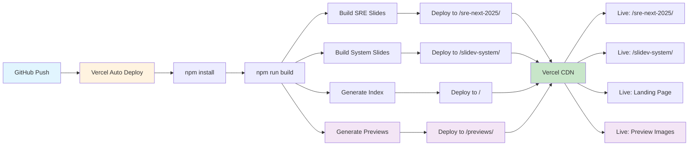

# My Slidev Presentations

📊 **複数のSlidevプレゼンテーションを管理するワークスペース**

## ✨ 新機能

### 🖼️ プレビュー画像表示機能
各スライドの1ページ目が自動でプレビュー画像として表示されます。
- Playwrightによる自動スクリーンショット生成
- フォールバック画像対応
- ホバーエフェクト付きの美しいカード表示

## 🚀 Live Demo

**メインページ**: https://my-slidev-eight.vercel.app/

### 利用可能なプレゼンテーション

- **SRE NEXT 2025**: https://my-slidev-eight.vercel.app/sre-next-2025/
  - **発表者モード**: https://my-slidev-eight.vercel.app/sre-next-2025/presenter/
  - **概要モード**: https://my-slidev-eight.vercel.app/sre-next-2025/overview/

- **Slidev System**: https://my-slidev-eight.vercel.app/slidev-system/
  - **発表者モード**: https://my-slidev-eight.vercel.app/slidev-system/presenter/
  - **概要モード**: https://my-slidev-eight.vercel.app/slidev-system/overview/

## 📁 プロジェクト構成

```
my-slidev-presentations/
├── pnpm-workspace.yaml        # ワークスペース設定
├── package.json               # ルートパッケージ
├── slides/                    # スライド専用ディレクトリ
│   ├── sre-next-2025/         # 各プレゼンテーション
│   │   └── src/
│   │       ├── slides.md      # スライド内容
│   │       └── package.json   # 個別設定
│   └── slidev-system/         # 2つ目のプレゼンテーション
│       └── src/
│           ├── slides.md      # スライド内容
│           └── package.json   # 個別設定
├── scripts/
│   ├── build-index.js         # インデックス生成
│   └── generate-previews.js   # プレビュー画像生成
├── dist/
│   └── previews/              # 生成されたプレビュー画像
└── vercel.json                # Vercel設定
```

## 🔄 デプロイフロー



## 🛠️ 開発

### ローカル開発

```bash
# 特定のプレゼンテーションを開発
npm run dev:sre-next-2025
npm run dev:slidev-system
```

### ローカルビルド（確認用）

```bash
# 全プレゼンテーションをビルド（プレビュー画像も生成）
npm run build

# 特定の処理のみ実行
npm run build:slides          # スライドのみビルド
npm run build:index           # インデックスページのみ生成
npm run build:previews        # プレビュー画像のみ生成
npm run generate-previews     # プレビュー画像を個別生成
```

> **Note**: 実際のデプロイは Vercel 上で自動実行されるため、ローカルでの `dist/` ディレクトリ生成は確認用途のみです。

## 🖼️ プレビュー画像生成について

プレビュー画像は以下の仕組みで自動生成されます：

### 生成フロー
1. **Chromiumブラウザ起動**: Playwrightでヘッドレスブラウザを起動
2. **スライドアクセス**: 各スライドの1ページ目にアクセス
3. **スクリーンショット**: 1280x720サイズで画像キャプチャ
4. **フォールバック**: 失敗時はSVGフォールバック画像を生成

### 生成されるファイル
```
dist/previews/
├── sre-next-2025.png         # SRE NEXTスライドのプレビュー
├── slidev-system.png         # Slidevシステムスライドのプレビュー
├── sre-next-2025-fallback.svg    # フォールバック画像（必要時）
└── slidev-system-fallback.svg    # フォールバック画像（必要時）
```

### カスタマイズ可能な設定
- **ビューポートサイズ**: 1280x720（変更可能）
- **待機時間**: スライド読み込み後2秒待機
- **画像形式**: PNG（高品質）
- **フォールバック**: グラデーション付きSVG

## 🌐 Vercel設定

### 自動デプロイ設定

`vercel.json` でビルドとルーティング、キャッシュを設定：

```json
{
  "installCommand": "npm install",
  "buildCommand": "npm run build",
  "rewrites": [
    { 
      "source": "/sre-next-2025/(.*)", 
      "destination": "/sre-next-2025/index.html" 
    },
    { 
      "source": "/slidev-system/(.*)", 
      "destination": "/slidev-system/index.html" 
    },
    { 
      "source": "/", 
      "destination": "/index.html" 
    }
  ],
  "headers": [
    {
      "source": "/previews/(.*)",
      "headers": [
        {
          "key": "Cache-Control",
          "value": "public, max-age=86400"
        }
      ]
    }
  ]
}
```

### デプロイトリガー

- **main ブランチへのプッシュ**: 自動的に本番デプロイ
- **feature ブランチへのプッシュ**: プレビューデプロイ
- **Pull Request**: プレビューURL自動生成

## 📝 現在のプレゼンテーション

### SRE NEXT 2025 - NoCスタッフ体験記

- **内容**: SRE NEXT 2025でNoCスタッフをやった話とSRE NEXTの講演紹介
- **トピック**: SRE, NoC, インフラ, 運用
- **更新**: 2025-07-17

### Slidev × Vercel 複数スライド管理システム

- **内容**: 1つのリポジトリで複数のSlidevプレゼンテーションを効率的に管理する仕組みの解説
- **トピック**: Slidev, Vercel, DevOps, Automation
- **更新**: 2025-07-18

## 🔧 技術スタック

- **Slidev**: スライド作成フレームワーク
- **pnpm workspace**: モノレポ管理
- **Vue.js**: フロントエンドフレームワーク  
- **Vercel**: ホスティング + CI/CD プラットフォーム
- **Playwright**: プレビュー画像生成
- **Markdown**: スライド記述言語

## 🆕 新しいプレゼンテーション追加方法

### Step 1: ディレクトリ作成

```bash
mkdir -p slides/{presentation-name}/src
```

### Step 2: package.json 作成

```bash
cat > slides/{presentation-name}/src/package.json << 'EOF'
{
  "name": "{presentation-name}",
  "type": "module",
  "private": true,
  "scripts": {
    "build": "slidev build --base /{presentation-name}/ --out ../../../dist/{presentation-name}",
    "dev": "slidev --open",
    "export": "slidev export"
  },
  "dependencies": {
    "@slidev/cli": "52.0.0",
    "@slidev/theme-default": "latest",
    "vue": "^3.4.31"
  },
  "devDependencies": {
    "playwright-chromium": "^1.45.1"
  }
}
EOF
```

### Step 3: slides.md 作成

```bash
cat > slides/{presentation-name}/src/slides.md << 'EOF'
---
theme: default
highlighter: shiki
lineNumbers: false
transition: slide-left
title: Your Presentation Title
---

# Your First Slide

Content goes here...

---

# Second Slide

More content...
EOF
```

### Step 4: ルート設定更新

1. **package.json** にビルドスクリプト追加:
```json
{
  "scripts": {
    "dev:{presentation-name}": "cd slides/{presentation-name}/src && npm run dev",
    "build:{presentation-name}": "cd slides/{presentation-name}/src && npm install && npm run build"
  }
}
```

2. **vercel.json** にルーティング追加:
```json
{
  "rewrites": [
    { 
      "source": "/{presentation-name}/(.*)", 
      "destination": "/{presentation-name}/index.html" 
    }
  ]
}
```

3. **scripts/build-index.js** にプレゼンテーション情報を追加

### Step 5: 開発開始

```bash
npm run dev:{presentation-name}
```

新しいプレゼンテーションを追加すると、次回のビルド時に自動的にプレビュー画像も生成されます。

## 🔮 今後の予定機能

現在以下の機能を開発中です：

- 🔍 **タグ検索・フィルタリング機能** - スライドをタグで絞り込み
- ⚙️ **Slidev統一設定ファイル** - 全スライドの設定を一元管理
- 🌍 **多言語対応** - 日本語・英語サイト切り替え
- 🚀 **スライド作成支援ツール** - インタラクティブなスライド作成

詳細は [GitHub Issues](https://github.com/wwlapaki310/my-slidev-presentations/issues) をご確認ください。

## 📚 参考リンク

- [Slidev公式ドキュメント](https://ja.sli.dev/)
- [pnpm workspace](https://pnpm.io/workspaces)
- [Vercel](https://vercel.com/)
- [Playwright](https://playwright.dev/)
- [参考実装](https://zenn.dev/jy8752/articles/ad565a43ba0e0a)

---

**Built with ❤️ using Slidev + pnpm workspace + Playwright**