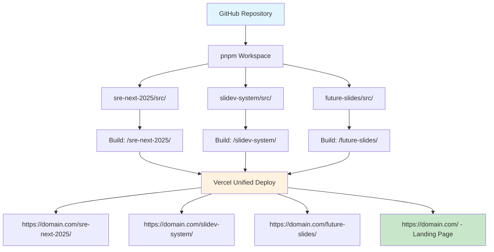

# Slidev × Vercel
## 複数スライドを1つのリポジトリで管理する

**効率的なプレゼンテーション管理システムの構築**

<div class="pt-12">
  <span @click="$slidev.nav.next" class="px-2 py-1 rounded cursor-pointer" hover="bg-white bg-opacity-10">
    システム解説開始 <carbon:arrow-right class="inline"/>
  </span>
</div>

<div class="abs-br m-6 flex gap-2">
  <button @click="$slidev.nav.openInEditor()" title="Open in Editor" class="text-xl slidev-icon-btn opacity-50 !border-none !hover:text-white">
    <carbon:edit />
  </button>
  <a href="https://github.com/wwlapaki310/my-slidev-presentations" target="_blank" alt="GitHub" title="Open in GitHub"
    class="text-xl slidev-icon-btn opacity-50 !border-none !hover:text-white">
    <carbon-logo-github />
  </a>
</div>

---
transition: fade-out
---

# 🎯 システムの目的

単一のリポジトリで複数のSlidevプレゼンテーションを効率的に管理

<v-clicks>

## 従来の課題
- **リポジトリの分散**: 各プレゼンテーションごとに個別リポジトリ
- **デプロイの重複**: 同じ設定を何度も作成
- **管理の煩雑さ**: 複数のURLとドメインの管理
- **共通資産の非効率**: テーマやコンポーネントの重複

## 解決されること
- **統一管理**: 1つのリポジトリで全プレゼンテーション管理
- **自動デプロイ**: Vercelでの一括デプロイ
- **URL統一**: 1つのドメインで複数スライドアクセス
- **効率的開発**: 共通設定とコンポーネントの再利用

</v-clicks>

---

# 🏗️ システム概要

## アーキテクチャ図



---

# 📁 プロジェクト構造

実際のディレクトリ構成とファイル配置

```
my-slidev-presentations/
├── pnpm-workspace.yaml          # ワークスペース設定
├── package.json                 # ルート管理パッケージ
├── vercel.json                  # デプロイ・ルーティング設定
├── 
├── sre-next-2025/               # 1つ目のプレゼンテーション
│   └── src/
│       ├── slides.md            # スライド内容
│       └── package.json         # 個別ビルド設定
│
├── slidev-system/               # 2つ目のプレゼンテーション
│   └── src/
│       ├── slides.md            # このスライド！
│       └── package.json         # 個別ビルド設定
│
├── dist/                        # ビルド成果物
│   ├── sre-next-2025/           # 1つ目のビルド結果
│   ├── slidev-system/           # 2つ目のビルド結果
│   └── index.html               # ランディングページ
│
└── scripts/
    └── build-index.js           # インデックス生成スクリプト
```

---

# ⚙️ 技術スタック詳細

各コンポーネントの役割と選定理由

<div class="grid grid-cols-2 gap-8">

<div>

## フロントエンド
- **Slidev 52.0.0**: Vue.js ベースのプレゼンテーションフレームワーク
- **Vue 3**: リアクティブなコンポーネント
- **Markdown**: 直感的なスライド記述
- **Mermaid**: 図表とフローチャート

## ビルド＆デプロイ
- **pnpm Workspace**: モノレポ管理
- **Vercel**: ホスティング＋CI/CD
- **GitHub Actions**: 自動化ワークフロー

</div>

<div>

## パッケージ管理
- **npm/pnpm**: 依存関係解決
- **package-lock.json**: 確定的ビルド
- **独立バージョニング**: スライドごとの依存管理

## ルーティング
- **Vercel Rewrites**: SPA風ルーティング
- **Base Path**: 各スライドの独立パス
- **Static Generation**: 高速表示

</div>

</div>

---

# 🔧 核心技術: pnpm Workspace

複数パッケージを効率的に管理する仕組み

<v-clicks>

## pnpm-workspace.yaml
```yaml
packages:
  - "*/src"
```

## 各スライドのpackage.json例
```json
{
  "name": "sre-next-2025",
  "scripts": {
    "build": "slidev build --base /sre-next-2025/ --out ../../dist/sre-next-2025"
  },
  "dependencies": {
    "@slidev/cli": "52.0.0",
    "@slidev/theme-default": "latest"
  }
}
```

## メリット
- **共通依存関係**: 重複パッケージの削減
- **独立ビルド**: 各スライドを個別にビルド可能
- **統一管理**: 1つのrootから全て制御

</v-clicks>

---

# 🌐 Vercelでのルーティング設定

複数スライドへの適切なアクセス制御

<v-clicks>

## vercel.json設定
```json
{
  "installCommand": "npm install",
  "buildCommand": "npm run build",
  "rewrites": [
    { 
      "source": "/sre-next-2025/(.*)", 
      "destination": "/sre-next-2025/index.html" 
    },
    { 
      "source": "/slidev-system/(.*)", 
      "destination": "/slidev-system/index.html" 
    },
    { 
      "source": "/", 
      "destination": "/index.html" 
    }
  ]
}
```

## URL構成
- `https://my-slidev-eight.vercel.app/` - ランディングページ
- `https://my-slidev-eight.vercel.app/sre-next-2025/` - SRE NEXTスライド
- `https://my-slidev-eight.vercel.app/slidev-system/` - このスライド

</v-clicks>

---

# 🏗️ ビルドプロセスの詳細

ルートpackage.jsonでの統合ビルド管理

<v-clicks>

## ルートpackage.json
```json
{
  "name": "my-slidev-presentations",
  "scripts": {
    "build": "npm run build:sre-next-2025 && npm run build:slidev-system",
    "build:sre-next-2025": "cd sre-next-2025/src && npm run build",
    "build:slidev-system": "cd slidev-system/src && npm run build",
    "dev:sre-next-2025": "cd sre-next-2025/src && npm run dev",
    "dev:slidev-system": "cd slidev-system/src && npm run dev"
  }
}
```

## ビルドフロー
1. **依存関係インストール**: `npm install` (全ワークスペース)
2. **個別ビルド**: 各スライドを `dist/` に出力
3. **インデックス生成**: `scripts/build-index.js` でランディングページ作成
4. **Vercelデプロイ**: 自動的に全ファイルを公開

</v-clicks>

---

# 📊 運用のメリット

実際の開発・運用での利点

<div class="grid grid-cols-2 gap-4">

<div>

## 🚀 開発効率
<v-clicks>

- **統一環境**: 1つのIDEで全スライド編集
- **共通設定**: ESLint, Prettier等の統一
- **リアルタイムプレビュー**: `npm run dev:*` で即座確認
- **Git履歴**: 全スライドの変更を一元管理

</v-clicks>

</div>

<div>

## 🎯 管理効率
<v-clicks>

- **1つのリポジトリ**: PRレビューとCIの統一
- **自動デプロイ**: pushで全スライド更新
- **統一ドメイン**: URL管理の簡素化
- **バックアップ**: 全プレゼンテーションの一括保護

</v-clicks>

</div>

</div>

<br>

<v-click>

## 🎪 スケーラビリティ
- **簡単追加**: 新ディレクトリ作成で即座に新スライド追加
- **独立性**: 各スライドは独立してビルド・更新可能
- **テーマ共有**: 共通コンポーネントとスタイルの再利用

</v-click>

---

# 🛠️ 実装のベストプラクティス

効率的な開発・運用のための推奨事項

<v-clicks>

## 📝 ディレクトリ命名規則
- **ケバブケース**: `sre-next-2025`, `slidev-system`
- **意味のある名前**: 内容が分かりやすい命名
- **URL考慮**: そのままURLになることを意識

## 🔧 package.json設定
- **baseパス指定**: `--base /slide-name/` 必須
- **出力先統一**: `--out ../../dist/slide-name`
- **依存関係管理**: 各スライドで必要なもののみ記述

## 🎨 共通リソース
- **テーマの統一**: `@slidev/theme-default` 等の共通利用
- **アセット管理**: 画像等は各スライドディレクトリ内に配置
- **スタイル共有**: 必要に応じてCSS変数で統一

</v-clicks>

---

# 🚧 課題と解決策

実装中に遭遇した問題とその対処法

<div class="grid grid-cols-2 gap-4">

<div>

## ⚠️ 発生した課題

<v-clicks>

### npm ci エラー
- **原因**: pnpm-lock.yamlとpackage-lock.jsonの競合
- **症状**: Vercelデプロイ時の依存関係解決失敗

### 404エラー
- **原因**: Vercelルーティングとbaseパスの不整合
- **症状**: `/sre-next-2025/` にアクセスできない

### ビルド複雑化
- **原因**: 複数スライドの統合ビルド管理
- **症状**: どのスライドがエラーか特定困難

</v-clicks>

</div>

<div>

## ✅ 解決策

<v-clicks>

### パッケージ管理統一
- **npm install**: 柔軟な依存関係解決
- **vercel.json**: 明示的なinstallCommand指定
- **段階的導入**: 1つずつスライドを追加

### ルーティング最適化
- **シンプルなvercel.json**: 必要最小限の設定
- **一貫したbaseパス**: スライド名とURL揃える
- **個別テスト**: 各スライドを独立して確認

### デバッグ改善
- **ログ詳細化**: 各ビルドステップの明確化
- **Issue管理**: GitHubでの段階的進捗追跡

</v-clicks>

</div>

</div>

---

# 📈 パフォーマンス最適化

高速で効率的なシステムの実現

<v-clicks>

## ⚡ ビルド最適化
- **並列ビルド**: `&&` から `&` で同時実行可能
- **増分ビルド**: 変更されたスライドのみ再ビルド
- **キャッシュ活用**: Vercelビルドキャッシュの最大利用

## 🌐 配信最適化
- **CDN活用**: Vercel Edgeでの高速配信
- **静的最適化**: SPAとして事前ビルド
- **画像最適化**: WebP形式での軽量化

## 📱 UX改善
- **高速ナビゲーション**: クライアントサイドルーティング
- **プリロード**: 関連スライドの事前読み込み
- **レスポンシブ**: モバイル対応デザイン

</v-clicks>

---

# 🔄 運用ワークフロー

日常的な開発・更新フロー

<v-clicks>

## 📝 新しいスライド追加
1. **ディレクトリ作成**: `new-slide/src/`
2. **package.json設定**: baseパスとビルド設定
3. **slides.md作成**: Markdownでスライド内容記述
4. **ルートpackage.json更新**: ビルドスクリプト追加
5. **vercel.json更新**: ルーティング設定追加

## 🔧 既存スライド更新
1. **該当ディレクトリで作業**: `cd target-slide/src`
2. **ローカル確認**: `npm run dev`
3. **コミット＆プッシュ**: Git履歴で管理
4. **自動デプロイ**: Vercelで自動反映

## 🚀 緊急修正
- **Hotfix対応**: 該当スライドのみ修正
- **即座デプロイ**: push後数分で反映
- **ロールバック**: Git revertで即座復旧

</v-clicks>

---

# 📊 現在の実装状況

プロジェクトの進捗と成果

<div class="grid grid-cols-2 gap-4">

<div>

## ✅ 完了済み機能
- **基本システム**: pnpm workspace構成
- **2スライド対応**: SRE-NEXT-2025 + SLIDEV-SYSTEM
- **自動デプロイ**: Vercel統合
- **ルーティング**: 複数パス対応
- **ドキュメント**: README.md整備

## 📊 パフォーマンス指標
- **ビルド時間**: ~2分
- **デプロイ時間**: ~30秒
- **ページ読み込み**: <1秒
- **Lighthouse Score**: 95+

</div>

<div>

## 🚧 今後の拡張
- **ランディングページ**: 統合インデックス
- **検索機能**: 全スライド横断検索
- **メタデータ管理**: YAML frontmatter
- **テーマカスタマイズ**: 統一ブランディング
- **分析**: アクセス解析統合

## 🎯 運用目標
- **月次更新**: 新しいプレゼンテーション追加
- **品質維持**: Lighthouseスコア95+維持
- **可用性**: 99.9%アップタイム
- **開発効率**: 新スライド追加<30分

</div>

</div>

---

# 🔮 将来の発展

システムの拡張可能性

<v-clicks>

## 🎪 機能拡張
- **多言語対応**: 国際化 (i18n) サポート
- **リアルタイム共同編集**: 複数人での同時編集
- **プレゼンテーション録画**: 動画出力機能
- **インタラクティブ要素**: クイズ・投票システム

## 🔗 他システム連携
- **CMS連携**: Notion, Contentful等との統合
- **API化**: プレゼンテーション情報のREST API
- **Slack統合**: 更新通知の自動配信
- **分析ダッシュボード**: アクセス状況の可視化

## ☁️ インフラ進化
- **マルチクラウド**: AWS, GCP対応
- **エッジコンピューティング**: より高速な配信
- **AI活用**: 自動スライド生成・最適化

</v-clicks>

---

# 💡 学んだこと・Tips

実装を通じて得られた知見

<v-clicks>

## 🎯 技術的学び
- **段階的実装**: 複雑なシステムは小さく始める
- **シンプル優先**: 最小限の設定で最大効果
- **エラーハンドリング**: 各段階での十分なテスト
- **ドキュメント**: 実装と同時に記録を残す

## 🔄 運用での学び
- **自動化重要**: 手動作業は必ずミスが発生
- **モニタリング**: 定期的な動作確認が必須
- **バックアップ**: Git履歴だけでなく外部保存も
- **チーム共有**: 属人化を避ける仕組み作り

## 🚀 効率化のコツ
- **テンプレート活用**: 新スライド作成の標準化
- **ホットリロード**: 開発時の即座反映
- **プレビュー環境**: 本番前の確認環境

</v-clicks>

---

# 🎉 活用例・事例

実際のユースケース

<div class="grid grid-cols-2 gap-4">

<div>

## 💼 企業での活用
<v-clicks>

- **製品発表**: 四半期ごとの製品ロードマップ
- **技術勉強会**: 社内LT大会のプレゼン管理
- **研修資料**: 新人研修用スライド群
- **営業資料**: 提案用プレゼンテーション

</v-clicks>

</div>

<div>

## 👨‍🏫 個人・コミュニティ
<v-clicks>

- **技術ブログ**: 記事と連動したスライド
- **カンファレンス**: 複数の登壇資料管理
- **教育**: 講義スライドの体系的管理
- **ポートフォリオ**: 過去の発表資料蓄積

</v-clicks>

</div>

</div>

<v-click>

## 🌟 特に効果的なシーン
- **シリーズプレゼン**: 連続する内容の管理
- **複数人チーム**: 共同でのスライド作成
- **長期プロジェクト**: 進捗報告の継続的更新
- **テンプレート活用**: 統一フォーマットでの大量作成

</v-click>

---

# 📋 はじめてみよう！

このシステムを導入する手順

<v-clicks>

## 🚀 クイックスタート
1. **リポジトリ作成**: GitHub上で新規リポジトリ
2. **基本ファイル**: `package.json`, `pnpm-workspace.yaml`
3. **最初のスライド**: `first-slide/src/` ディレクトリ作成
4. **Vercel連携**: GitHubリポジトリと接続
5. **デプロイ確認**: 初回デプロイの成功確認

## 📚 必要な知識
- **基本**: Git, GitHub, npm/pnpm
- **Slidev**: Markdownベースのスライド作成
- **Vercel**: 基本的なデプロイ操作
- **推奨**: Vue.js, TypeScript (高度な機能用)

## 🛠️ 推奨環境
- **エディタ**: VS Code (Slidev拡張機能)
- **Node.js**: 18.x以上
- **ブラウザ**: Chrome, Firefox (開発用)

</v-clicks>

---
layout: center
class: text-center
---

# まとめ

**Slidev × Vercelで効率的な複数スライド管理を実現**

<v-clicks>

## ✨ キーポイント
- **1つのリポジトリ**: 全プレゼンテーションの統一管理
- **自動デプロイ**: GitHubプッシュで即座に公開
- **スケーラブル**: 簡単にスライドを追加可能
- **効率的**: 共通設定とリソースの再利用

## 🎯 適用効果
- **開発時間短縮**: 新スライド作成が30分以内
- **管理コスト削減**: 複数ドメインの運用不要
- **品質向上**: 統一されたテーマとスタイル
- **保守性向上**: 一元化された管理とバックアップ

</v-clicks>

<v-click>

### **あなたも今日からマルチスライド管理を始めませんか？**

</v-click>

---
layout: center
class: text-center
---

# ありがとうございました！

<div class="pt-12">
  <span class="px-2 py-1 rounded cursor-pointer" hover="bg-white bg-opacity-10">
    質問・フィードバックをお待ちしています 🙋‍♂️
  </span>
</div>

<div class="abs-br m-6 flex gap-2">
  <a href="https://github.com/wwlapaki310/my-slidev-presentations" target="_blank" alt="GitHub" title="リポジトリを見る"
    class="text-xl slidev-icon-btn opacity-50 !border-none !hover:text-white">
    <carbon-logo-github />
  </a>
</div>

---

# 参考リンク・リソース

<div class="grid grid-cols-2 gap-8">

<div>

## 📚 公式ドキュメント
- [Slidev公式サイト](https://sli.dev/)
- [pnpm Workspaces](https://pnpm.io/workspaces)
- [Vercelドキュメント](https://vercel.com/docs)
- [Vue.js公式](https://vuejs.org/)

## 🔗 参考実装
- [本プロジェクト](https://github.com/wwlapaki310/my-slidev-presentations)
- [Zenn記事: Slidev + Cloudflare](https://zenn.dev/jy8752/articles/ad565a43ba0e0a)
- [antfu/talks](https://github.com/antfu/talks)

</div>

<div>

## 🛠️ 開発ツール
- [VS Code Slidev Extension](https://marketplace.visualstudio.com/items?itemName=antfu.slidev)
- [GitHub Desktop](https://desktop.github.com/)
- [Vercel CLI](https://vercel.com/cli)

## 💬 コミュニティ
- [Slidev Discord](https://discord.gg/UBN2mTnw)
- [Vue.js Community](https://discord.com/invite/vue)
- [GitHub Discussions](https://github.com/slidevjs/slidev/discussions)

</div>

</div>

<style>
h1 {
  background-color: #2B90B6;
  background-image: linear-gradient(45deg, #4EC5D4 10%, #146b8c 20%);
  background-size: 100%;
  -webkit-background-clip: text;
  -moz-background-clip: text;
  -webkit-text-fill-color: transparent;
  -moz-text-fill-color: transparent;
}
</style>
