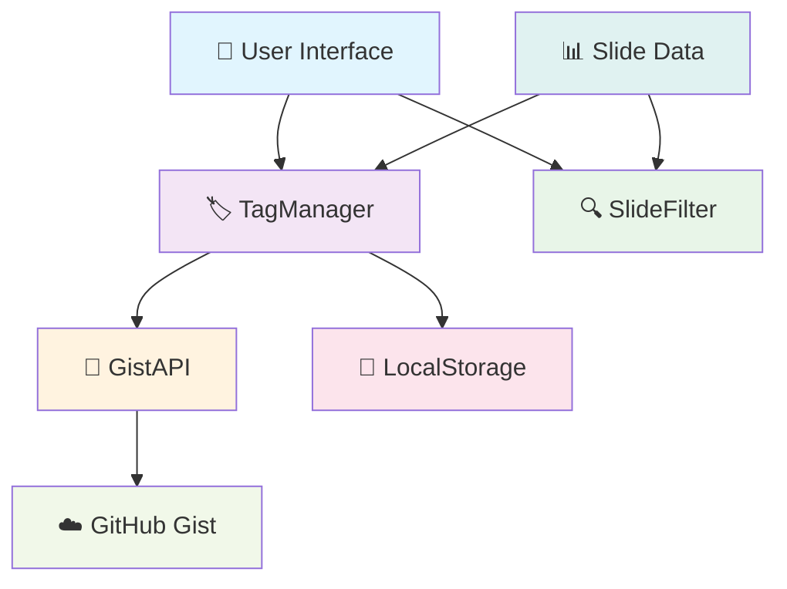
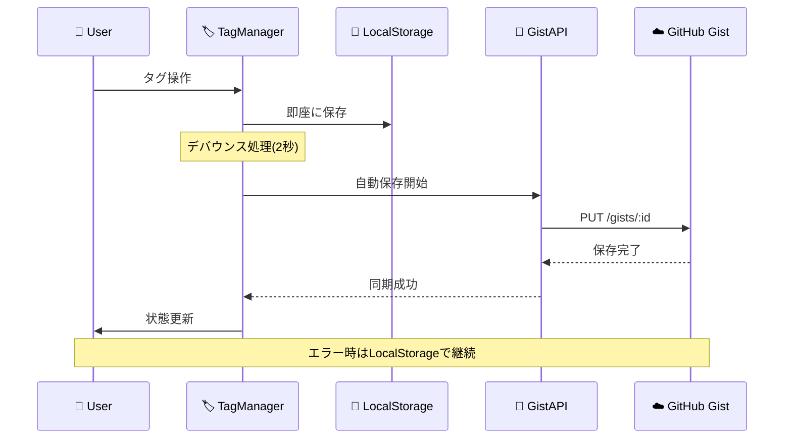

# Smart Tag System

## GitHub Gist連携による自動永続化

**スライド管理システムの革新的なタグシステム**

設計思想から実装まで

<div class="pt-12">
  <span @click="$slidev.nav.next" class="px-2 py-1 rounded cursor-pointer" hover="bg-white bg-opacity-10">
    Press Space for next page <carbon:arrow-right class="inline"/>
  </span>
</div>

<div class="abs-br m-6 flex gap-2">
  <button @click="$slidev.nav.openInEditor()" title="Open in Editor" class="text-xl slidev-icon-btn opacity-50 !border-none !hover:text-white">
    <carbon:edit />
  </button>
  <a href="https://github.com/wwlapaki310/aki310-slides" target="_blank" alt="GitHub" title="Open in GitHub"
    class="text-xl slidev-icon-btn opacity-50 !border-none !hover:text-white">
    <carbon-logo-github />
  </a>
</div>

---
transition: fade-out
---

# 🤔 以前の問題点

従来のタグシステムには多くの課題がありました

<v-clicks>

- 📄 **`manage-tags.html`による手動管理**
  - 複雑な専用ページが必要
  - ユーザビリティが低い

- 💾 **JSONファイルダウンロード**
  - 手動でファイルをダウンロード
  - リポジトリに手動アップロード

- 💻 **LocalStorageのみの永続化**
  - ブラウザ固有のデータ
  - デバイス間の同期不可

- 🔄 **複数環境での同期困難**
  - 開発・本番環境でのデータ不整合
  - チーム間での共有が困難

</v-clicks>

<div v-after class="text-center mt-8">
  <div class="text-red-400 text-xl font-bold">
    手動作業が多すぎて使いづらい... 😰
  </div>
</div>

---
transition: slide-up
layout: image-right
image: https://images.unsplash.com/photo-1555949963-aa79dcee981c?ixlib=rb-4.0.3&auto=format&fit=crop&w=1920&q=80
---

# 💡 設計コンセプト

## 完全自動化への挑戦

<v-clicks>

### 🎯 **ワンページ完結**
- 専用管理ページの廃止
- メインページに全機能統合

### 🤖 **自動永続化**
- GitHub Gist API活用
- 手動ファイル操作の完全排除

### 🌐 **クラウド同期**
- Personal Access Token認証
- 複数環境での自動同期

### 📱 **直感的UX**
- インライン編集
- リアルタイム反映

</v-clicks>

---
transition: slide-left
---

# 🏗️ 新しいアーキテクチャ

## シンプルで強力な構成



<div class="grid grid-cols-2 gap-4 mt-4">
  <div>
    <h3>🔧 Core Components</h3>
    <ul>
      <li><code>GistAPI</code> - GitHub API wrapper</li>
      <li><code>TagManager</code> - タグ管理ロジック</li>
      <li><code>SlideFilter</code> - フィルタリング</li>
    </ul>
  </div>
  <div>
    <h3>💾 Storage Strategy</h3>
    <ul>
      <li><strong>Primary</strong>: GitHub Gist</li>
      <li><strong>Fallback</strong>: LocalStorage</li>
      <li><strong>Sync</strong>: Auto-save + Token auth</li>
    </ul>
  </div>
</div>

---
transition: fade-out
---

# 🔄 データフロー

## 自動永続化の仕組み



<div class="mt-6">
  <div class="bg-blue-50 p-4 rounded-lg">
    <h3 class="text-blue-800 font-bold">🚀 パフォーマンス最適化</h3>
    <ul class="text-blue-700 text-sm mt-2">
      <li>• <strong>即座反映</strong>: LocalStorageで瞬時UI更新</li>
      <li>• <strong>バックグラウンド同期</strong>: ユーザー操作を妨げない</li>
      <li>• <strong>デバウンス処理</strong>: 連続変更の効率的な集約</li>
    </ul>
  </div>
</div>

---
layout: two-cols
---

# 📊 データ構造

## GitHub Gistに保存されるJSON

```json {all|1-12|13-18|19-21}
{
  "tags": {
    "tech": {
      "name": "Tech",
      "color": "blue", 
      "description": "技術系の発表",
      "createdAt": "2025-07-20T12:00:00Z"
    },
    "business": {
      "name": "Business",
      "color": "green",
      "createdAt": "2025-07-20T12:05:00Z"
    }
  },
  "assignments": {
    "sre-next-2025": ["tech", "sre"],
    "slidev-system": ["tech", "business"]
  },
  "lastUpdated": "2025-07-20T12:10:00Z"
}
```

::

<div class="pl-4">

## 🔧 設計のポイント

<v-clicks>

### 📝 **タグ定義**
- ID、名前、色、説明を管理
- ISO 8601形式のタイムスタンプ

### 🔗 **関連付け**
- スライドIDとタグIDの配列
- 多対多の柔軟な関係

### ⏰ **同期管理**
- 最終更新時刻で競合解決
- Last-write-wins戦略

</v-clicks>

<div v-after class="mt-6 p-3 bg-green-50 rounded">
  <strong class="text-green-800">💡 Why JSON?</strong>
  <p class="text-green-700 text-sm">シンプル、軽量、GitHub Gistで完璧に動作</p>
</div>

</div>

---
transition: slide-up
---

# 🎮 ユーザーインターフェース

## ワンページ完結の統合設計

<div class="grid grid-cols-2 gap-8">

<div>

### 🏷️ **タグ管理**

```vue
<!-- メインページ上部 -->
<section class="tag-management">
  <input placeholder="New tag name..." />
  <button @click="addTag()">Add Tag</button>
  
  <!-- タグ一覧 -->
  <div v-for="tag in tags">
    <span :class="getColorClass(tag.color)">
      {{ tag.name }}
    </span>
    <button @click="removeTag(tag.id)">×</button>
  </div>
</section>
```

</div>

<div>

### 📝 **インライン編集**

```vue
<!-- 各スライドカード内 -->
<div class="slide-card">
  <h3>{{ slide.title }}</h3>
  
  <!-- タグ表示エリア -->
  <div class="tags">
    <span v-for="tag in slideTags" 
          @click="applyFilter(tag.id)">
      {{ tag.name }}
    </span>
  </div>
  
  <!-- 編集ボタン -->
  <button @click="editTags(slide.id)">
    Edit Tags
  </button>
</div>
```

</div>

</div>

<div class="mt-6 text-center">
  <div class="bg-yellow-50 p-4 rounded-lg inline-block">
    <strong class="text-yellow-800">🎯 UXの核心</strong>
    <p class="text-yellow-700">全ての操作を最小クリック数で実現</p>
  </div>
</div>

---
transition: fade-out
---

# 🔧 技術実装

## GitHub Gist APIとの連携

<div class="grid grid-cols-2 gap-6">

<div>

### 🔐 **認証フロー**

```javascript
class GistAPI {
  constructor() {
    this.token = localStorage.getItem('github-token');
    this.gistId = localStorage.getItem('gist-id');
  }
  
  async makeRequest(endpoint, options = {}) {
    return fetch(`https://api.github.com${endpoint}`, {
      headers: {
        'Authorization': `token ${this.token}`,
        'Accept': 'application/vnd.github.v3+json',
        ...options.headers
      },
      ...options
    });
  }
}
```

</div>

<div>

### 💾 **データ永続化**

```javascript
class TagManager {
  async saveData(data) {
    // 即座にローカル保存
    localStorage.setItem('tag-data', JSON.stringify(data));
    
    // バックグラウンドでGist同期
    if (this.gistAPI.isConfigured()) {
      await this.gistAPI.saveData({
        ...data,
        lastUpdated: new Date().toISOString()
      });
    }
  }
  
  scheduleAutoSave() {
    clearTimeout(this.autoSaveTimeout);
    this.autoSaveTimeout = setTimeout(() => {
      this.saveData(this.data);
    }, 2000); // 2秒後に自動保存
  }
}
```

</div>

</div>

---
layout: image-right
image: https://images.unsplash.com/photo-1551288049-bebda4e38f71?ixlib=rb-4.0.3&auto=format&fit=crop&w=1920&q=80
---

# ⚡ パフォーマンス最適化

## 高速でスムーズな体験

<v-clicks>

### 🚀 **即座反映戦略**
- LocalStorage: < 1ms
- UI更新: 即座
- Gist同期: バックグラウンド

### 🎯 **デバウンス処理**
- 連続操作の集約
- APIリクエスト数削減
- レート制限回避

### 📦 **効率的なデータ管理**
- 差分更新のみ
- 最小限のペイロード
- キャッシュ戦略

### 🔄 **エラー耐性**
- オフライン対応
- 自動復旧機能
- データ損失防止

</v-clicks>

---
transition: slide-left
---

# 🌟 実装結果

## Before vs After

<div class="grid grid-cols-2 gap-8">

<div>

### ❌ **Before (複雑)**

- 📄 専用管理ページ必須
- 💾 手動JSONダウンロード
- 🔄 手動ファイルアップロード
- 💻 LocalStorageのみ
- 🤕 複数環境同期不可
- 😰 ユーザービリティ低

<div class="mt-4 p-3 bg-red-50 rounded">
  <strong class="text-red-800">結果: 使いづらい</strong>
</div>

</div>

<div>

### ✅ **After (シンプル)**

- 🎯 ワンページ完結
- 🤖 完全自動永続化
- ☁️ クラウド同期対応
- 📱 直感的なUX
- 🚀 リアルタイム反映
- 😊 ストレスフリー

<div class="mt-4 p-3 bg-green-50 rounded">
  <strong class="text-green-800">結果: 超使いやすい</strong>
</div>

</div>

</div>

<div class="text-center mt-8">
  <div class="text-3xl">🎉</div>
  <div class="text-xl font-bold text-green-600">
    手動作業完全排除に成功！
  </div>
</div>

---
transition: fade-out
---

# 📈 使用フロー

## 超シンプルな3ステップ

<div class="space-y-8">

<v-clicks>

<div class="flex items-center space-x-4">
  <div class="w-12 h-12 bg-blue-500 text-white rounded-full flex items-center justify-center font-bold text-xl">1</div>
  <div>
    <h3 class="text-xl font-bold">初回設定（1回のみ）</h3>
    <p class="text-gray-600">GitHub Personal Access Tokenを設定</p>
  </div>
</div>

<div class="flex items-center space-x-4">
  <div class="w-12 h-12 bg-green-500 text-white rounded-full flex items-center justify-center font-bold text-xl">2</div>
  <div>
    <h3 class="text-xl font-bold">タグ作成・編集</h3>
    <p class="text-gray-600">メインページで直接タグ管理 → 自動保存</p>
  </div>
</div>

<div class="flex items-center space-x-4">
  <div class="w-12 h-12 bg-purple-500 text-white rounded-full flex items-center justify-center font-bold text-xl">3</div>
  <div>
    <h3 class="text-xl font-bold">フィルタリング</h3>
    <p class="text-gray-600">タグクリック → 即座にフィルタ適用</p>
  </div>
</div>

</v-clicks>

</div>

<div v-after class="mt-12 text-center">
  <div class="bg-gradient-to-r from-blue-500 to-purple-500 text-white p-6 rounded-lg inline-block">
    <div class="text-2xl font-bold">💯 DX Score</div>
    <div class="text-sm mt-1">Developer Experience が劇的に向上</div>
  </div>
</div>

---
layout: center
class: text-center
---

# 🎊 まとめ

## Smart Tag System の成果

<v-clicks>

<div class="space-y-6 text-xl">
  <div>✅ <strong>手動ファイル管理</strong> → 完全自動化</div>
  <div>✅ <strong>複雑なUI</strong> → ワンページ完結</div>
  <div>✅ <strong>環境固有データ</strong> → クラウド同期</div>
  <div>✅ <strong>煩雑な操作</strong> → 直感的UX</div>
</div>

<div class="mt-12">
  <div class="text-2xl font-bold text-blue-600">
    🚀 革新的なタグシステムの完成！
  </div>
  <div class="text-lg text-gray-600 mt-2">
    GitHub Gist + 自動永続化 + インライン編集
  </div>
</div>

</v-clicks>

<div v-after class="mt-8">
  <a href="https://github.com/wwlapaki310/aki310-slides" target="_blank" 
     class="inline-flex items-center space-x-2 bg-gray-900 text-white px-6 py-3 rounded-lg hover:bg-gray-700 transition-colors">
    <carbon-logo-github class="text-xl" />
    <span>View on GitHub</span>
  </a>
</div>

---
layout: end
---

# Thank you!

### Questions & Discussion

<div class="mt-8 text-center">
  <div class="text-gray-500">
    Powered by Slidev + GitHub Gist ✨
  </div>
</div>